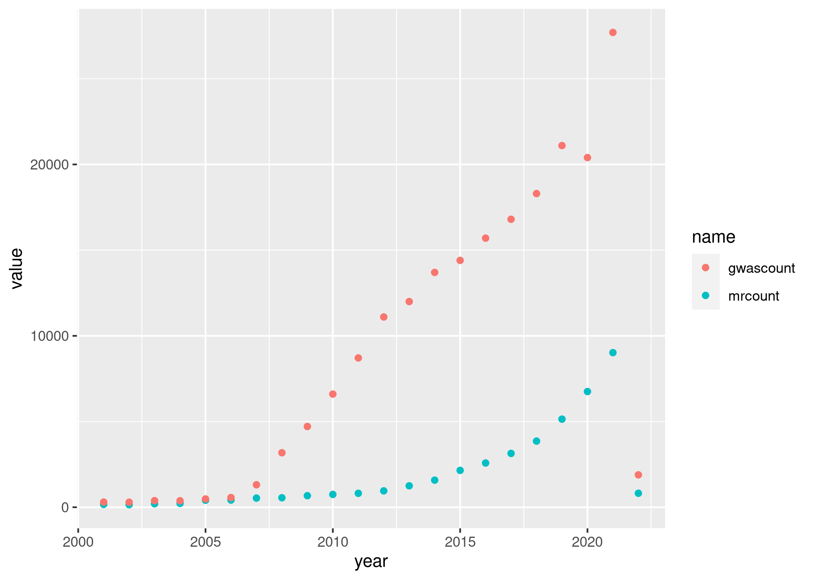

```{r setup, include=FALSE}
knitr::opts_chunk$set(echo = TRUE)
```


# Introduction

Great interest has developed in inferring causal relationships between complex 
traits, *i.e.*, traits that seemingly are not inherited in a Mendelian fashion, in observational human genetics studies. Discovery of such relationships is crucial to 
enhancing our understanding of the biology of health and disease. Two-sample 
Mendelian randomization (MR) studies are a form of instrumental variable analysis in which
genetic markers, typically single nucleotide polymorphisms (SNPs), serve as instruments for 
inferring causal effects of an exposure variable on an outcome variable [@wright1928tariff;@wright1921correlation;@wright1923theory;@stock2003retrospectives;@katan1986apolipoprotein;@katan2004commentary;@didelez2007mendelian]. They are termed 
"two-sample" MR studies because the exposure variable and the outcome variable are measured on 
two non-overlapping cohorts of subjects. Importantly, the SNP instruments are measured in both sets of subjects.


Genome-wide association studies (GWAS) present unique opportunities for 
discovery of causal relationships via MR. A GWAS
interrogates millions of single nucleotide polymorphisms (SNPs) to infer which affect the trait [@the_wellcome_trust_case_control_consortium_genome-wide_2007;@klein_complement_2005].
In the nearly 17 years since publication of early studies, researchers have reported 
tens of thousands of novel SNP-trait associations from GWAS [@klein_complement_2005;@welter_nhgri_2014;@visscher_10_2017;@visscher_five_2012].  

```{r, article-counts, fig.cap= "Upward trend in article counts by year for keyword searches: 1. mendelian randomization and 2. genome-wide association study."}

```


Methods for and uses of MR have appeared at a rapid and accelerating pace since the 
publication of the early GWAS (Figure \@ref(fig:article-counts)). Inverse variance 
weighted MR [@burgess_mendelian_2013], MR-Egger [@bowden_mendelian_2015], weighted 
median estimation [@bowden_consistent_2016], Bayesian weighted MR 
[@zhao_bayesian_2019], robust adjusted profile score [@zhao_statistical_2020], MRMix 
[@qi_mendelian_2019], CAUSE [@morrison_mendelian_2020], and MRAID 
[@yuan_likelihood_2021] are all recent methods developments. These methods differ in 
their approaches to two challenges: 

1. instrument selection (from among the available SNPs)  
1. modeling and controlling for horizontal pleiotropy  

Many MR methods use a set of pre-selected SNPs as instruments. Typically, these SNPs are selected to 
be statistically independent. This restriction to 
independent SNPs is needed for valid inference in methods like inverse variance weighting MR [@burgess_mendelian_2013]. The independent SNPs may be 
selected through linkage disequilibrium (LD) clumping. In this procedure, SNPs 
are ranked by the strength of their marginal association with the exposure 
variable. The LD clumping procedure then outputs high ranking SNPs that are not in high LD with each other.

LD clumping for choosing instrument SNPs can be problematic for several 
reasons. First, the chosen SNPs may not be causal for the outcome. This can 
happen, for instance, by using a noncausal SNP that is in high LD with a 
causal SNP. Second, because many traits are polygenic or omnigenic, multiple 
causal SNPs may be in high LD together. LD clumping is likely to omit one or more
of the causal SNPs, which can diminish statistical power in MR analysis.

Horizontal pleiotropy occurs when a SNP instrument affects the outcome through at least one pathway that bypasses the exposure variable [@verbanck_detection_2018]. It constitutes a violation of 
the standard MR assumptions and can lead to biased 
causal effect estimates and diminished statistical power. We discuss approaches to 
modeling horizontal pleiotropy below.


Recent methods developments have enabled execution of two-sample MR studies with only 
GWAS summary statistics [@burgess2015using]. These strategies are especially pertinent now that there is 
an abundance of freely available GWAS summary data [@buniello2019nhgri]. The 
ability to use published data has contributed to a rapid increase in the number of
two-sample MR methods for GWAS summary statistics. 


# Mendelian Randomization with one Instrument

We begin our discussion of Mendelian randomization in GWAS data by considering the simplest case, where 
there is a single genetic marker and a single outcome variable. Mendelian randomization with one 
instrument uses a single genetic marker 
as the proxy ("instrument" or "instrumental variable") for the "exposure", a complex trait, and asks 
whether variation in the genotypes at the genetic marker causes variation in the 
"outcome" variable, which is typically a second complex trait. When the genetic marker 
is a SNP on an autosome, the cohort is partitioned into three 
classes, two homozygote classes and a single heterozygote class, based on genotypes 
for that marker. When the three assumptions of mendelian randomization are satisfied, 
estimation of the causal effect of the exposure on the outcome is possible. 

The outcome variable can be binary, a count, a time to event, or a continuous variable. For brevity and simplicity, 
we focus on continuous outcomes before considering other classes of outcome variables in a later section.

## Assumptions of Mendelian Randomization

Three assumptions are central to MR. Satisfying them enables inference of 
causal effects in an observational MR study. In practice, careful evaluation of the assumptions is needed. 
The first assumption states that the exposure is associated with the outcome. The second requires 
independence, conditional on the exposure and all measured and unmeasured confounders, between the 
genetic marker and the outcome. The last of the three assumptions states that the genetic marker is 
independent of all (measured and unmeasured) confounders of the relationship between exposure and 
outcome. We next discuss these in more detail and consider their evaluation in MR studies [@vanderweele_methodological_2014].

If the first assumption, about the association between the genetic marker and the exposure, holds, 
but this association is weak, then an amplification of biases, such as those due to violations of 
assumptions 2 and 3, may result [@vanderweele_methodological_2014]. @burgess_avoiding_2011, in analyses 
of simulated and real data, demonstrated that bias in causal estimates increases with decreases in 
the strength of association between the SNP and exposure. We later discuss, in the context of 
methods for multiple SNP instruments, how this finding, coupled with the recognition of 
the polygenicity of many complex traits, has motivated methods to work with large numbers of weak SNP instruments [@ye_debiased_2021;@chao_consistent_2005].


The second MR assumption, often termed the exclusion restriction assumption, can also be stated as 
the need for the genetic marker to affect the outcome only through the exposure. In a 
causal diagram, this means that the only path from the marker to the outcome is that 
containing the exposure.

The third assumption ensures that the genetic marker is
independent of all confounders of the exposure-outcome relationship. 

When the three MR assumptions hold, one may use instrumental variable statistical methods, 
with the genetic marker data, the exposure data, and the outcome data, to estimate and to test the 
causal effect of the exposure on the outcome [@didelez_mendelian_2007;@lawlor_mendelian_2008;@palmer_adjusting_2008]. It's important 
to recognize that assumptions 2 and 3, which require absence of two types of confounding, 
can't be verified in observational studies. For this reason, researchers have developed 
sensitivity analysis to consider the robustness of their inferences to possible violations 
of assumptions 2 and 3.

To understand the origin of the term "Mendelian randomization", it is helpful to 
recall Mendel's inheritance laws. Under the assumption that alleles segregate 
randomly from parent to offspring, the offspring genotypes are unlikely to be 
associated with confounders of the exposure-outcome relationship. Additionally,
reverse causation is ruled out by the observation that germ-line genotypes are 
fixed at conception and, thus, precede other observed variables.


## Statistical models and methods for MR with one instrument and one outcome


Many approaches to MR can be classified into two categories: two-stage methods and 
likelihood-based methods. Both two-stage strategies and likelihood-based strategies 
make parametric assumptions for the identification of causal effects [@burgess_review_2017].


A two-stage statistical model involves two regression models [@burgess_review_2017;@sawa_exact_1969]. For a continuous 
outcome, one may choose to perform "two-stage least squares", which involves two linear regressions. 
First, the exposure variable is regressed on the instrument (*i.e.*, the SNP genotypes) (Equation \@ref(eq:lm1)). The resulting 
fitted values for the exposure variable are the independent variable in the second linear regression, 
where the outcome variable is the dependent variable. The causal effect estimate, then, is the 
coefficient $\hat \beta_1$ obtained from the second regression analysis (Equation \@ref(eq:lm2)). 


\begin{equation}
  x_i = \alpha_0 + \alpha_1 z_i + \epsilon_i
  (\#eq:lm1)
\end{equation}

where the $\epsilon_i$ are assumed to be independent and identically distributed normal random variables with mean zero. 


\begin{equation}
  y_i = \beta_0 + \beta_1 \hat x_i + \tau_i
  (\#eq:lm2)
\end{equation}


where the $\tau_i$ are assumed to be independent and identically distributed  normal random variables with mean zero and $\hat x_i$ denotes the fitted value for $x_i$ obtained from Equation \@ref(eq:lm1).


Note that the uncertainty in the fitted values from 
the first regression is not considered when performing the second regression.
For this reason, the variance of the coefficient estimator, $Var(\hat \beta_1)$ is 
incorrect in two-stage calculations. This observation led researchers to develop 
likelihood-based MR methods.

Likelihood-based MR methods, unlike two-stage methods, provide maximum likelihood 
estimates with their many desirable properties. Limited information maximum likelihood from econometrics 
is the earliest approach for likelihood-based inference in MR [@davidson1993estimation]. CoMM and PMR-Egger are two recent likelihood-based methods [@yang_comm_2019;@yuan_testing_2020]. 

Limited information maximum likelihood model equations are shown below (Equations \@ref(eq:lm5) and \@ref(eq:lm6)).

\begin{equation}
  x_i = \alpha_0 + \alpha_1 z_i + \epsilon_i
  (\#eq:lm5)
\end{equation}

\begin{equation}
  y_i = \beta_0 + \beta_1 \hat x_i + \tau_i
  (\#eq:lm6)
\end{equation}

They differ from the two-stage model because the two error terms, $\epsilon_i$ and $\tau_i$, have a bivariate normal
distribution. 


CoMM, along with its extension for summary statistics, CoMM-S2, uses a collaborative mixed model to 
relate exposure and outcome variables to the SNP genotypes [@yang_comm-s2_2020]. Model fitting then 
proceeds via a parameter-expanded EM algorithm [@yang_comm_2019;@liu_parameter_1998]. 

We discuss PMR-Egger below in the context of methods that model horizontal pleiotropy. 


## Assumption violations

There are several ways that experimental data may violate one or more of the three MR assumptions.
Let's first consider the exclusion restriction assumption (assumption 2 above). It states that the genetic marker 
must affect the outcome only through the exposure. The causal diagram in Figure \@ref(fig:dag1) illustrates 
a scenario that violates this assumption when the variable X is used as the exposure [@vanderweele_methodological_2014]. Bias in causal effect estimation would result. However, 
if variable W is measured and treated as the exposure, then an unbiased estimate of causal effect is 
possible, since W captures the two pathways, W -> Y and W -> X -> Y, through which the genetic marker G 
affects the outcome Y [@vanderweele_methodological_2014;@textor2011dagitty;@textor2016robust].

```{r, dag1, fig.cap = "Scenario where the genetic variant G affects an intermediate variable W on the pathway to the exposure X. This violates the exclusion restriction assumption."}
g1 <- dagitty::dagitty( "dag {
	G -> W -> X -> Y
	W -> Y
}")
plot(dagitty::graphLayout(g1))
```


Recognition of the many ways that the MR assumptions may be violated has inspired methods advances that 
enable assumption relaxations and has motivated use of sensitivity analysis to quantify the impact of 
possible assumption violations. 

## Sensitivity analysis for MR with one instrument and one outcome

Sensitivity analysis is recommended and widely used in MR studies because of the inability to verify 
the three MR assumptions with observational data. The goal of a sensitivity analysis is to gain insight 
into how the results might differ if the assumptions are violated.

Because not all confounding 
variables are known or measured, assumptions 2 and 3 are not fully verifiable 
in MR studies. Recognition of this fact has inspired the development of 
sensitivity analysis tools. While we can't assess whether a SNP instrument is 
associated with every confounder of the exposure-outcome association, it is 
possible to examine the associations of the SNP instrument with the measured 
covariates. While absence of such associations doesn't guarantee satisfaction 
of the assumption, presence of SNP-covariate associations must be investigated
carefully, as they may constitute assumption violations [@burgess_sensitivity_2017]. 

@burgess_sensitivity_2017 considered a collection of sensitivity analysis methods when 
working with GWAS summary statistics. @burgess_sensitivity_2017 presented methods for both assessing the
MR assumptions, to the extent possible, and performing robust analyses. For example, 
they used measured covariates to assess for possible associations with the SNP 
instruments. While they can't rule out the possibility of unmeasured confounding, they can study the possibility of measured covariates serving as confounders. 

To illustrate their approach, @burgess_sensitivity_2017 shared a case study in which they examined the causal effect of 
C-reactive protein (CRP) levels on coronary artery disease risk with four genetic 
variants in the CRP gene region and 17 other genetic variants that affect coronary 
artery disease risk. They use measured covariates to probe for SNP-covariate 
associations, and followed it up with scatter plots and Cochran's Q test on the causal 
estimates to inquire about whether the 
SNP instruments all identify the same causal parameter [@greco_m_detecting_2015;@small_sensitivity_2007;@higgins_measuring_2003]. 
Additionally, @burgess_sensitivity_2017 suggests using a funnel plot, like those in the 
meta-analysis literature, to visualize possible evidence of directional pleiotropy, where the average pleiotropic effects of the SNP instruments is nonzero [@sterne_recommendations_2011]. Additionally, Egger regression can be useful in this 
setting [@egger_bias_1997;@bowden_mendelian_2015].


# Mendelian Randomization with multiple SNP instruments

Recognition of complex traits' diverse genetic architectures has fueled development of two-sample MR 
methods with multiple SNP instruments [@hormozdiari_leveraging_2018;@watanabe_global_2019;@pierce_power_2011;@bowden_mendelian_2015]. 
Choosing a subset of the available SNPs to serve as instruments is one issue that arises 
in MR studies. The solution to this task differs among published methods. Early methods chose a 
set of independent SNPs [@verbanck_detection_2018;@zhu_causal_2018;@zeng_causal_2019-2;@zeng_causal_2019-1]. However, this approach can be problematic when there are multiple causal 
SNPs in LD with each other. In this setting, discarding some of the causal SNPs may only capture a small
proportion of trait variance explained by the exposure and lead to a power loss in MR [@burgess_review_2017;@burgess_mendelian_2013;@burgess_combining_2016;@burgess_bias_2011]. In support of
this is the finding that including multiple correlated SNPs in transcriptome-wide association
studies improves power compared to using independent SNPs only [@liu2021multi;@gusev_integrative_2016;@yuan_testing_2020;@zeng_non-parametric_2017]. 


## Statistical models and methods for MR with multiple instruments and one outcome

In the case of continuous exposures and outcomes, researchers have taken several approaches to extend the methods and models for 
single-SNP MR to accommodate multiple SNPs. For two stage analyses, one may perform 
a sequence of two linear regressions, as in the single-SNP MR models (Equations \@ref(eq:lm3) and \@ref(eq:lm4)). 
For an analysis
with $S$ SNP instruments, one performs two stage analysis by first regressing the 
exposure $n$ vector $X$ on the $n$ by $S + 1$ matrix of SNP instruments (and an intercept). Taking the fitted exposure values 
from this regression, the second stage involves regressing the outcome variable $Y$ on 
the fitted values, $\hat X$. 


\begin{equation}
  X  = Z\alpha + \epsilon
  (\#eq:lm3)
\end{equation}

where $\epsilon$ is assumed to be a vector of independent and identically distributed normal random variables with mean zero. 


\begin{equation}
  Y = \hat X\beta + \tau
  (\#eq:lm4)
\end{equation}


# Horizontal pleiotropy

Pleiotropy, where a single genetic variant affects multiple traits, has a long history of study in genetics and complex traits [@solovieff_pleiotropy_2013;@visscher_plethora_2016;@stearns_one_2010]. Horizontal pleiotropy refers to the presence of multiple causal pathways from a genetic 
variant to the outcome. 
The fact that there are pathways that exclude the exposure and connect the SNP to the outcome violates
standard MR assumptions. @verbanck_detection_2018 documented widespread horizontal pleiotropy 
in GWAS. This finding motivated the development of MR-PRESSO and inspired 
further research into methods to model horizontal pleiotropy [@verbanck_detection_2018].

Researchers have recognized two types of horizontal pleiotropy [@yuan_likelihood_2021]. The first occurs via 
exposure-independent paths. The resulting horizontal pleiotropic effects are independent of the
SNP-exposure relationships. The second type of horizontal pleiotropy manifests when 
in the presence of unobserved exposure-outcome confounding. It induces correlation between 
horizontal pleiotropic effects and SNP-exposure effects. Both types of horizontal pleiotropy 
violate standard MR modeling assumptions and can bias causal effect estimates and can increase false 
discoveries [@yuan_likelihood_2021].
Early MR analyses avoided confounding from horizontal pleiotropy by discarding 
instrumental SNPs that might be associated with the outcome 
[@verbanck_detection_2018;@zhu_causal_2018;@zeng_causal_2019-1;@zeng_causal_2019-2].
More recent methods have attempted to model horizontal pleiotropy 
[@morrison_mendelian_2020;@yuan_testing_2020;@yuan_likelihood_2021]. CAUSE [@morrison_mendelian_2020] and 
MRMix [@qi_mendelian_2019] both use a mixture of normal distributions to control for both 
types of horizontal pleiotropy. Modeling both types of horizontal pleiotropy is particularly 
challenging because the MR model likelihood often involves an integral that can't be solved analytically. 
Because of this issue with the model likelihood, both MRMix and CAUSE use other, non-likelihood-based methods for inference.
MRMix uses ...
CAUSE compares the out-of-sample prediction accuracies for two competing models that differ in inclusion of 
the causal effect parameter [@morrison_mendelian_2020]. Specifically, CAUSE calculates the expected log pointwise posterior density 
between the two models. 
MRAID models horizontal pleiotropy by ...
@yuan_likelihood_2021 found that MRMix is not robust to misspecification of SNP effect sizes and often is 
biased. CAUSE, they found, yields overly conservative p-values [@yuan_likelihood_2021].


probabilistic Mendelian randomization (PMR-Egger) for two-sample MR with correlated SNPs models [@yuan_testing_2020] 

Early MR methods account manage horizontal pleiotropy by removing instrumental SNPs 
that may be associated with the outcome variable [@verbanck_detection_2018;@zhu_causal_2018;@zeng_causal_2019-1;@zeng_causal_2019-2]. 


# Correlated horizontal pleiotropy

The second type of horizontal pleiotropy, from above, is sometimes called "correlated horizontal pleiotropy". Correlated horizontal pleiotropy occurs when 
CAUSE and MRAID are two methods that aim to model and to account for correlated horizontal pleiotropy. 


# Recent Findings

## Omnigenic MR

Recent research on the omnigenic hypothesis, which posits 
that every SNP's effect on a trait is nonzero, has informed
MR methods development [@Boyle2017]. @wang_mendelian_nodate 
recognized the limitations of previous MR methods in the 
context of the omnigenic hypothesis. To accommodate the possibility
that a trait is influenced by many genome-wide, small effects, 

## Multiple outcomes in MR

Investigators have found that combining information from multiple related 
traits can lead to richer MR results [@liu_multi-trait_2021]. 

One approach to combining information across traits is to extend the 
univariate MR statistical methods to their multivariate analogs.

# Applications of MR in GWAS 


# Software 

# Non-continuous outcomes

Binary, survival, count - see discussion section of MRAID paper.
@allman_novel_2021 @burgess_improving_2012


# Summary and Outlook

Modern GWAS for biobank-scale data offer the possibility
of discovering even more causal relationships among complex traits. The large
sample sizes in biobank studies, often greater than 100,000 
subjects, offer the possibility of uncovering associations of modest strength 
that might be undetectable in smaller studies. For example, the UK 
Biobank Study involves more than 500,000 subjects. Each UKB subject's 
data consists of millions of SNP genotypes and measurements for 
thousands of traits [@bycroft_uk_2018]. 


# References

